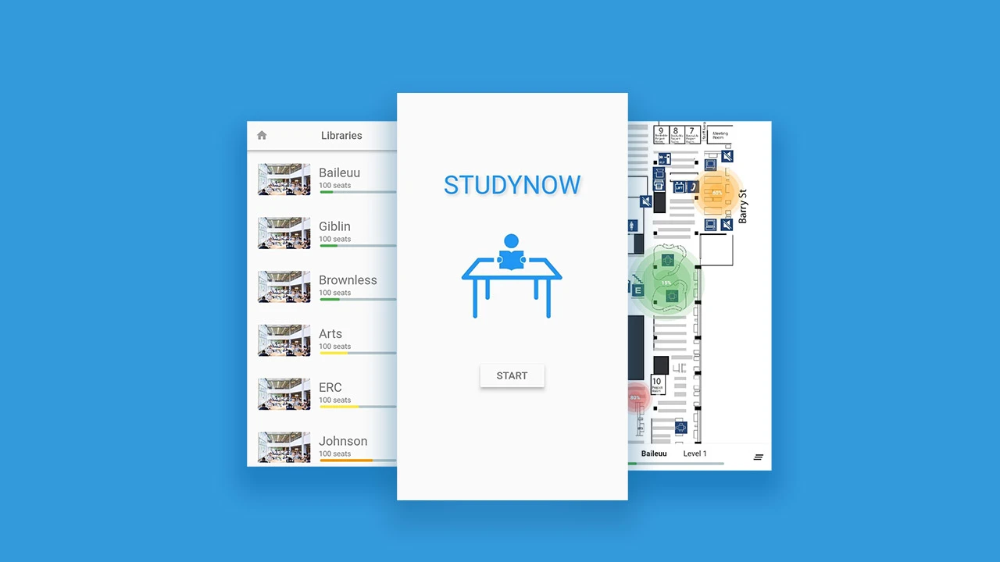

# StudyNow

Collection of software to power the StudyNow experience, which allows people to find free seats at university.

This project was originally started by myself and 2 others.

It's main goals is to allow users to find which seats were free in study spaces around uni. Originally to a precision of a the seats themselves. Due to technical and security reasons, this was revised to a precision of how busy a table/zone was.

The StudyNow app has 3 components:
1. The user app, which people use to consume the free seat info
2. An ML program that can be installed on phones that act as cameras. This program analyses image data and uses a model to determine which seats are free and which aren't. It feeds this back to a firebase database.
3. An admin panel which allows control of the free seat detectors and monitoring of their status.
4. An installation app that allows administrators to install the cameras and keep track of them.

  

